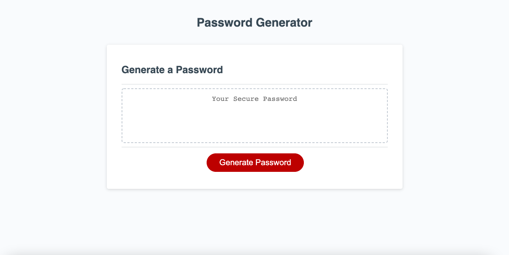
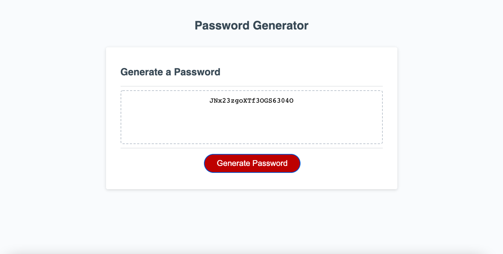

# Password Generator using Javascript

This generates a random password based on user-selected criteria. It gives several prompts to users to select options. Once all prompts are answered, the user will be given a password of their choice.

## Technology used
- HTML
- CSS
- Javascript

## Screenshots

## Deployment URL
https://17keerti.github.io/password-generator-29thmarch/
